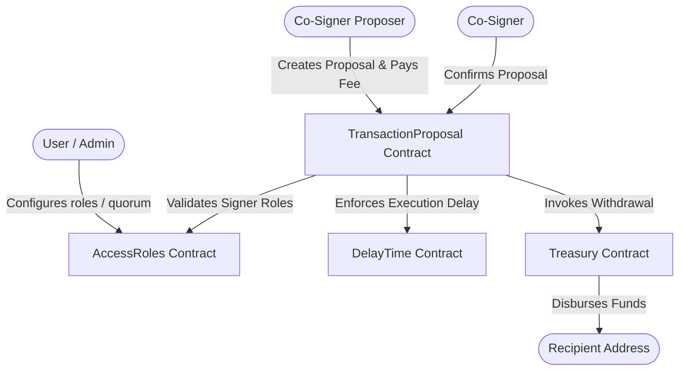

# StellarVault

StellarVault is a decentralized, multi-signature treasury and governance system built on the Stellar network using Soroban smart contracts. It provides secure, quorum-based authorization and timelocked execution for managing shared digital assets, ensuring that no single signer can unilaterally control or transfer funds.

---

## 🔑 Key Features

- **Decentralized Multi-Signature Quorum**: Enforces consensus requirements (e.g., $m$-of-$n$ approvals) before any treasury payout can be executed.
- **Timelocked Execution (Delay Phase)**: Imposes a mandatory waiting period between proposal approval and execution to give the governing community a response window and prevent rapid exploit attacks.
- **Granular Role-Based Access Control (RBAC)**: Distinct permissions for System Admins and Co-signers managed in a dedicated roles registry.
- **Anti-Spam Proposal Fees**: Requires proposers to deposit a configurable fee to submit proposals, economically discouraging spam.
- **Self-Service Treasury Vault**: Secure user deposit and withdrawal mechanisms with integrated safeguards against double-spending and reentrancy.

---

## 🏗️ System Architecture

StellarVault is structured as an interactive suite of modular Soroban contracts deployed on the Stellar network.

### High-Level Components



### Modular Smart Contracts

The system logic is divided into four main roles, all integrated within the workspace:

1. **`AccessRoles`**: Handles registry of co-signers, addition/removal of signers by the administrator, and system quorum enforcement (validates that $0 < \text{quorum} \le \text{total signers}$).
2. **`DelayTime`**: Manages execution delay configurations (up to a maximum safety threshold of 30 days) and validates whether the timelock duration has elapsed for a approved proposal.
3. **`Treasury`**: Manages token reserves, handles user deposits and personal withdrawals, and executes authorized transfers only upon direct verification from the proposal contract.
4. **`TransactionProposal`**: Governs proposal state transitions (`PENDING` → `CONFIRMED` → `EXECUTED` / `CANCELLED`), tracks individual confirmations (with double-voting protection), and manages proposal fee structures.

---

## 📂 Project Structure

```
StellarVault/
├── contracts/                  # Soroban Smart Contracts
│   ├── src/
│   │   └── lib.rs              # Contract logic (AccessRoles, Delay, Treasury, Proposals)
│   ├── Cargo.toml              # Rust workspace dependencies
│   └── Cargo.lock
├── frontend/                   # Client Web Application
│   ├── src/
│   │   ├── pages/              # React components & UI views (Next.js Pages router)
│   │   └── styles/             # Tailwind CSS stylesheets
│   ├── public/                 # Static asset delivery
│   ├── tsconfig.json           # TypeScript compilation configuration
│   └── package.json            # Node.js dependencies & scripts
├── ARCHITECTURE.md             # Detailed technical specifications & flowcharts
└── README.md                   # Project Overview & Quickstart
```

---

## 🚀 Getting Started

### Prerequisites

To compile the smart contracts and run the frontend application locally, make sure you have the following installed:
- [Rust & Cargo](https://rustup.rs/) (latest stable version)
- [Soroban CLI](https://soroban.stellar.org/docs/getting-started/setup#install-the-soroban-cli)
- [Node.js](https://nodejs.org/) (v18 or higher) & `npm`

---

### 🔨 Smart Contract Setup

#### 1. Compile Contracts
Build the Soroban WASM bytecodes from the repository root:
```bash
cargo build --workspace --target wasm32-unknown-unknown --release
```

#### 2. Run Tests
Verify the contract workflow using Rust's integrated test harness:
```bash
cargo test --workspace
```
The workspace includes unit and integration tests verifying roles setup, delay calculation, treasury deposits/withdrawals, and proposal confirmation/execution lifecycles.

---

### 💻 Frontend Client Setup

The frontend is built using **Next.js**, **React**, **TypeScript**, and **Tailwind CSS**.

#### 1. Install Dependencies
Navigate to the `frontend` folder and install all project dependencies:
```bash
cd frontend
npm install
```

#### 2. Run the Development Server
Launch the local development environment:
```bash
npm run dev
```
Open [http://localhost:3000](http://localhost:3000) in your browser to view the application.

---

## 🛡️ Security Boundaries

StellarVault is designed around clear interface boundaries to minimize the attack surface:
- **Authorization Separation**: Admins can configure the signers and settings, but they cannot propose or sign treasury transactions unless they are explicitly assigned the signer role.
- **Double-Spending Prevention**: The treasury contract maintains strict balances, verifying total reserves before completing any external transfer.
- **Quorum & Timelocks**: Even if a signer's private key is compromised, no funds can be drained instantly; the hacker would need to compromise a quorum of signers, and the community has a timelocked window to cancel the transaction.

---

## 🤝 Contributing

We welcome contributions to StellarVault! To contribute, please follow these guidelines:

### 1. Fork & Branch
- Fork the repository and create your branch from `main`:
  ```bash
  git checkout -b feature/your-feature-name
  ```

### 2. Code Standards
- **Smart Contracts**: 
  - Format your code before submitting: `cargo fmt`
  - Run the linter: `cargo clippy`
  - Run all tests to make sure everything passes: `cargo test --workspace`
- **Frontend**:
  - Run the linter: `npm run lint`
  - Ensure TypeScript type checking passes.

### 3. Commit Messages
- Use clear, descriptive commit messages.
- Prefix commits to indicate the context of changes (e.g., `feat(contracts):`, `fix(frontend):`, `docs:`).

### 4. Submitting a Pull Request
- Push your changes to your fork and submit a Pull Request.
- Provide a clear description of the problem solved, the changes implemented, and how they were tested.
- Ensure all checks and tests pass.
